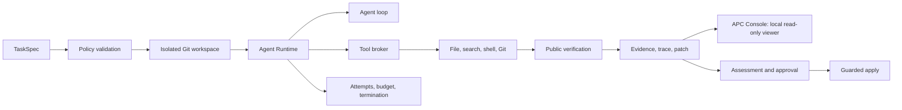
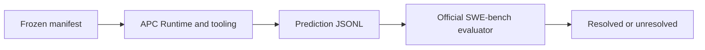
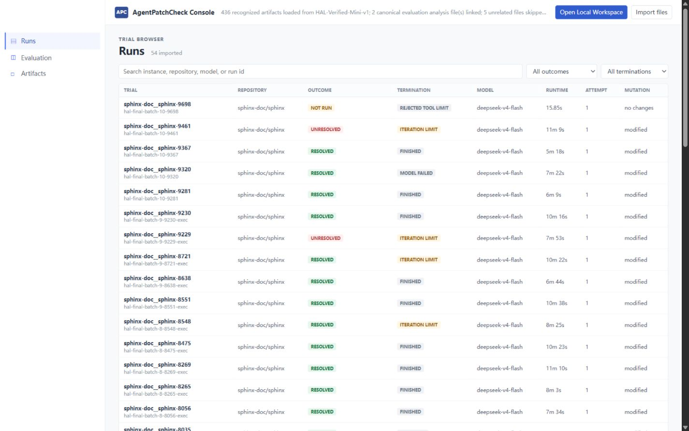
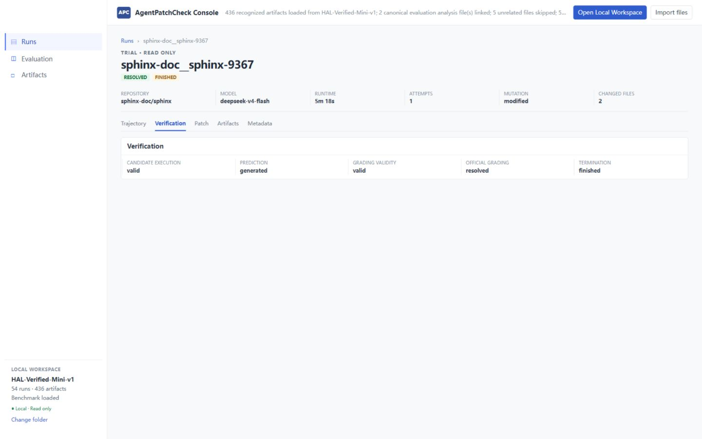
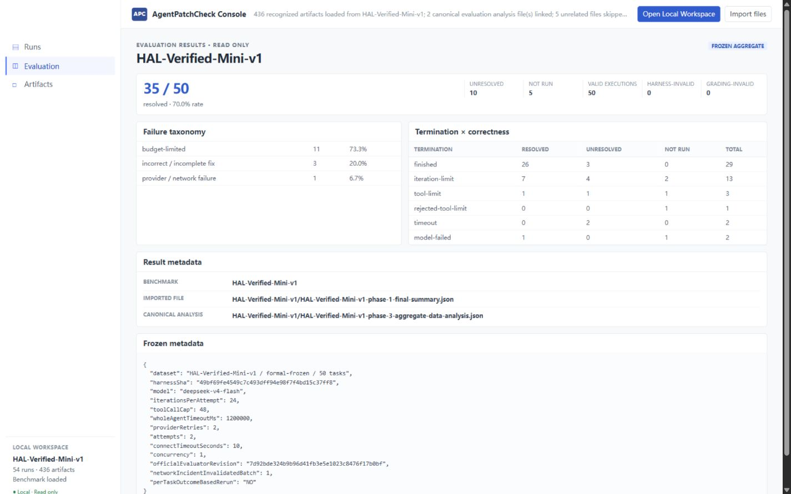
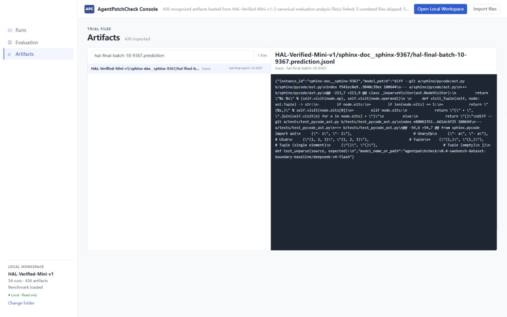

# AgentPatchCheck

> **Coding Agent Runtime & Evaluation Harness** for controlled, repository-level software repair.

[](https://github.com/aravelo7/agentpatchcheck/actions/workflows/test.yml)


## HAL SWE-bench Verified Mini fixed-50

| Metric | Result |
| --- | ---: |
| Official resolved | **35 / 50** |
| Resolution rate | **70.0%** |
| Valid executions | **50 / 50** |
| Harness-invalid | **0** |
| Grading-invalid | **0** |

This is the end-to-end result of **deepseek-v4-flash + APC Runtime/tooling +
frozen execution policy**, graded by the official SWE-bench evaluator. It is
not a full SWE-bench Verified score, a model-only score, or an independently
measured APC causal uplift.

**Agent Loop · Tool Calling · Workspace Isolation · Budget & Termination ·
Verification · Trace · Official Evaluation**

## Why AgentPatchCheck

A completed agent turn or emitted diff is not proof of a correct repair. APC
bounds the runtime, controls repository tools and workspaces, records the
execution trace, verifies the patch, and keeps application behind a separate
approval gate. It is a practical harness for building, testing, and evaluating
coding agents without conflating completion with correctness.

## 🏗️ Architecture



Frozen SWE-bench execution remains a distinct upstream-evaluator path:



## Core Capabilities

- **Agent loop and tool calling:** bounded iterations, calls, output, deadlines, cancellation, and recovery.
- **Workspace isolation:** per-run Git worktrees plus constrained file, search, shell, and Git tools.
- **Verification and assessment:** public verification, hidden Oracle evaluation, risk checks, approval, and guarded apply.
- **Evidence and trace:** structured trajectories, execution results, patches, EvidenceBundles, assessment reports, and benchmark reports with sensitive-text redaction.
- **Evaluation orchestration:** sequential benchmark execution, prediction generation, evaluator bridging, and independent execution/grading validity tracking.

## APC Console

APC Console is a local, read-only Runtime & Evaluation viewer for imported
Agent runs, verification results, artifacts, and benchmark analysis. It uses
browser-authorized folder import and recursive discovery to consume existing
artifacts only.

```bash
cd apc-console
npm ci
npm run dev
```

It supports:

- **Open Local Workspace** with recursive artifact discovery.
- **Runs** browsing and Run Detail with verification facts.
- An **Artifact explorer and preview** for imported runtime and evaluator
  outputs.
- **Benchmark Evaluation** with the canonical P2 failure taxonomy and P3
  termination × correctness analysis.

The Console is the observation and evaluation layer after controlled execution
and independent evaluation; it is not an execution control plane. It never
writes back to the workspace, launches a Candidate, executes a Provider or
benchmark, or exposes Apply, Retry, or mutation controls.

### Runs

The Runs browser presents imported execution records, outcomes, termination,
model, runtime, attempts, and mutation facts from the local workspace.



### Run inspection

Run Detail exposes the imported verification facts for an individual real run.



### Benchmark evaluation

The frozen aggregate view makes the official HAL result, execution validity,
P2 failure taxonomy, and P3 termination × correctness analysis directly
inspectable.



### Artifact explorer

The artifact explorer previews the imported evidence and evaluator outputs
without altering them.



## 📊 Benchmark

### HAL SWE-bench Verified Mini fixed-50

| Metric | Result |
| --- | ---: |
| Official resolved | **35 / 50** |
| Resolution rate | **70.0%** |
| Valid executions | **50 / 50** |
| Harness-invalid | **0** |
| Grading-invalid | **0** |

#### Notes

This fixed-50 result is one frozen end-to-end configuration:
`deepseek-v4-flash` with APC Runtime/tooling and the declared execution
policy. It is neither a complete SWE-bench Verified score nor evidence that APC
independently causes a given uplift.

#### Observed non-resolved categories

| Observed non-resolved category | Count |
| --- | ---: |
| Budget-bound termination | **11** |
| Incorrect / incomplete fix | **3** |
| Provider failure | **1** |

Budget-bound is an observed terminal category; it does not mean that raising a
budget would solve the task.

#### Termination and correctness

| Observed pairing | Count |
| --- | ---: |
| `iteration-limit` → officially resolved | **7** |
| `tool-limit` → officially resolved | **1** |
| `model-failed` → officially resolved | **1** |
| `finished` → officially unresolved | **3** |

> **Termination status is not a correctness proxy.** Official grading remains
> the correctness authority for this benchmark.

## 🚀 Quick Start

### Prerequisites

- Node.js 22 or newer
- npm 10 or newer
- Git
- An installed agent/provider required by the TaskSpec

### Headless development path

Install root dependencies and run the existing development CLI with a TaskSpec
that points to your own checkout and target repository:

```bash
npm install
npm run agentpatchcheck:run -- --task-spec ./path/to/task-spec.json
```

The script invokes `tsx src/agentpatchcheck/cli.ts run`. Read the
[Headless Core guide](docs/agentpatchcheck-headless-core.md) before preparing a
TaskSpec or applying a patch.

### Full repository / release build

The independent local APC Console lives in [`apc-console/`](apc-console/).
Existing root web and desktop build paths are separate from APC Console and
are not part of the APC Runtime & Evaluation workflow described here.
For the repository and release build:

```bash
npm run install:all
npm run build
node dist/agentpatchcheck.js --help
```

## How It Works

### Headless repair

```text
TaskSpec → Runtime → Tool Calls → Verification → Evidence → Assessment → Guarded Apply
```

1. A TaskSpec becomes a policy with repository, provider, verification, and risk boundaries.
2. APC creates an isolated worktree and executes the selected adapter through its bounded runtime.
3. Verification, trace, evidence, and patch outputs support assessment and any guarded apply decision.

### Benchmark evaluation

```text
Frozen Manifest → APC Runtime / Tooling → Prediction → Official SWE-bench Evaluator → BenchmarkReport → APC Console
```

1. A frozen manifest drives APC Runtime and tooling to produce predictions.
2. The official SWE-bench evaluator is used only for this benchmark path and produces the BenchmarkReport.
3. APC Console reads existing runtime artifacts and benchmark outputs locally; it does not participate in execution.

See [Headless Core](docs/agentpatchcheck-headless-core.md) for CLI, evidence,
retention, and guarded-apply contracts.

## Implementation Boundaries

| Area | APC implements | Reused / integrated |
| --- | --- | --- |
| Agent execution | Agent runtime/loop, tool broker, attempts, budgets, termination, evidence, assessment | Provider model reasoning |
| Repository operations | Policy-controlled workspace lifecycle and repair orchestration | Git / worktree primitives |
| Benchmarking | Manifest orchestration, prediction bridge, validity tracking, reports | Official SWE-bench evaluator and upstream datasets |
| Code Mode | APC integration and tool execution boundary | Selected DeepSeek Harness mechanisms |

Third-party components and retained upstream attribution are documented in
[THIRD_PARTY_NOTICES.md](THIRD_PARTY_NOTICES.md). APC does not claim authorship
of the official evaluator or complete benchmark datasets.

## Frozen Benchmark Reproduction Contract

The repository preserves the portable reproduction contract, not a one-command
replica of the published run. Complete datasets, evaluator checkout and Python
environment, repositories, Docker images, predictions, logs, and scored
artifacts are external to this repository.

| Contract item | Frozen value / requirement |
| --- | --- |
| Dataset source | `MariusHobbhahn/swe-bench-verified-mini`, `test` split, revision `b316c349947c29963fce3f4a65967c9807a4b673` |
| Selected subset | `HAL-Verified-Mini-v1.full.jsonl`, 50 rows, SHA-256 in the tracked manifest |
| Evaluator | official SWE-bench checkout at `7d92bde324b9b96d41fb3e5e1023c8476f17b0bf` |
| Model profile | `deepseek-v4-flash` |
| Entry point | `node_modules/.bin/tsx src/agentpatchcheck/swebench-cli.ts` |

Set these existing bootstrap variables in the operator environment; do not put
credential values in manifests, source, or evidence:

```text
DEEPSEEK_API_KEY
AGENTPATCHCHECK_SWEBENCH_MANIFEST
AGENTPATCHCHECK_SWEBENCH_EVALUATOR_ROOT
AGENTPATCHCHECK_SWEBENCH_EVALUATOR_PYTHON
```

For one manifest-selected instance and a fresh run identity:

```powershell
node_modules/.bin/tsx src/agentpatchcheck/swebench-cli.ts `
  --instance <instance-id-from-the-manifest> `
  --run-id <fresh-run-id>
```

The manifest owns dataset identity, evaluator revision, model, timeout, and
classification. Operator arguments cannot override them; this is not an
instruction to rerun the published fixed-50 result.

## Documentation

- [Headless Core](docs/agentpatchcheck-headless-core.md) — TaskSpec, CLI, evidence, assessment, approval, cleanup, and apply.
- [Historical Formal Runtime Contract](docs/formal-runtime-contract.md) — frozen lifecycle semantics for the formal pilot.
- [Harness-native Benchmark Suite](docs/harness-native-benchmark-suite.md) — deterministic suite boundaries and reports.
- [Third-party notices](THIRD_PARTY_NOTICES.md) — retained attribution and license notices.

## Limitations

- Fixed-50 is not a complete SWE-bench Verified score.
- This result has no alternative-runtime ablation and does not isolate APC Runtime causal uplift.
- Budget-bound termination is not proof that additional budget would resolve a task.
- Provider access, evaluator setup, Docker images, upstream repositories, and benchmark data are external dependencies.

## Project Status

AgentPatchCheck is an open-source engineering project focused on auditable,
bounded software-repair execution and truthful benchmark reporting. Interfaces
and operational requirements may change before a stable release.

Licensed under [Apache-2.0](LICENSE). See
[THIRD_PARTY_NOTICES.md](THIRD_PARTY_NOTICES.md) for retained upstream copyright
and attribution.
